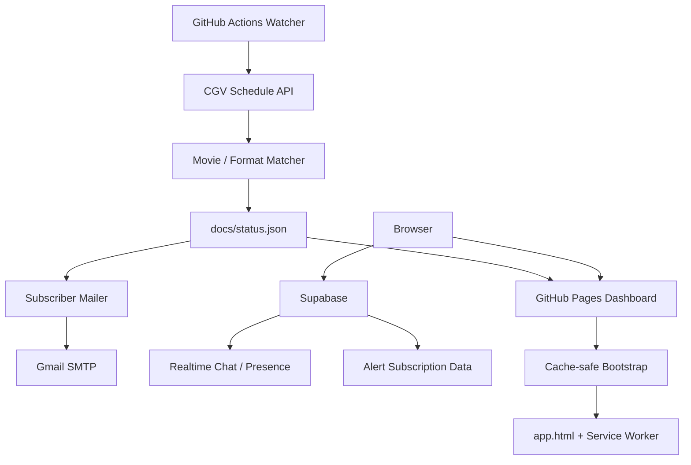

# CGV WATCHER

[](https://github.com/LIM-AIT/cgv-api-watcher/actions/workflows/ci.yml)


CGV 상영 일정 API를 주기적으로 확인하고, 지정 영화/특별관의 예매 오픈 상태를 **GitHub Pages 대시보드 + 이메일 알림**으로 제공하는 개인용 모니터링 프로젝트입니다.

> 자동 예매, 로그인, 좌석 선택, 결제, CAPTCHA 우회 기능은 수행하지 않습니다.

## Live Dashboard

**https://lim-ait.github.io/cgv-api-watcher/**

현재 운영 구조에서는 PC를 계속 켜둘 필요가 없습니다. 감시는 GitHub Actions에서 실행되고, 결과는 `docs/status.json`에 기록되어 GitHub Pages에서 표시됩니다.

## Current Stable Features

- CGV 상영 일정 JSON API 직접 조회
- 여러 극장 동시 감시
- 여러 날짜 범위 감시
- 영화 번호(`movNo`) + 영화명 키워드 매칭
- IMAX / SCREENX 등 특별관 포맷별 감지
- GitHub Actions 기반 장시간 연속 감시
- `docs/status.json` 자동 갱신
- 모바일 대응 GitHub Pages 대시보드
- 극장/날짜별 예매 페이지 바로가기
- 개인 Gmail 알림 및 중복 알림 방지
- 구독자 이메일 알림 처리
- Supabase 기반 실시간 채팅
- 관리자 인증/관리자 전용 메시지 표시
- 보호 닉네임 차단 및 채팅 금칙어 필터
- 접속자 Presence 표시
- 반응속도 테스트 + Global TOP 5
- 모바일 캐시 대응용 bootstrap + Service Worker 구조
- CI (`ruff`, `pytest`)

## Current Monitoring Targets

현재 `run_multi_special.py` 기준 기본 대상은 다음과 같습니다.

| Target | Movie | Format | Period |
|---|---|---|---|
| `odyssey_imax` | The Odyssey / 오디세이 | IMAX | 2026-08-25 ~ 2026-09-07 |
| `spiderman_screenx` | Spider-Man: Brand New Day | SCREENX | 2026-08-19 ~ 2026-09-07 |

기본 극장:

- 영등포타임스퀘어 (`0059`)
- 용산아이파크몰 (`0013`)

운영 대상은 코드/환경변수 변경으로 교체할 수 있습니다.

## How It Runs

### Watcher

`.github/workflows/watch.yml`이 약 **150초 간격**으로 다음 작업을 반복합니다.

1. 기존 개인 알림용 watcher 실행 (`run.py --once`)
2. 다중 특별관 상태 수집 (`run_multi_special.py`)
3. `docs/status.json` 갱신
4. 변경 사항이 있으면 `main`에 상태 커밋
5. 약 5시간 세션 종료 후 다음 workflow를 자동 시작

### Subscriber Mailer

`.github/workflows/subscriber-mailer.yml`은 약 **30초 간격**으로 구독 상태와 최신 `status.json`을 확인하고 필요한 이메일을 발송합니다.

### Dashboard

GitHub Pages는 `docs/`를 서비스합니다.

```text
/cgv-api-watcher/
  index.html   -> cache-safe bootstrap
  app.html     -> actual dashboard UI
  status.json  -> watcher output
```

루트 `index.html`은 매 접속마다 timestamp가 붙은 `app.html?t=...`로 이동합니다. `app-cache-guard.js`와 `sw.js`는 모바일 브라우저에서 오래된 HTML/JS/CSS가 남는 현상을 줄이기 위해 사용합니다.

## Architecture



자세한 구조는 [`docs/architecture.md`](docs/architecture.md), 운영 절차는 [`docs/operations.md`](docs/operations.md)를 참고하세요.

## Status Model

대시보드에서 사용하는 주요 상태:

| Status | Meaning |
|---|---|
| `OPEN` | 지정 특별관 일정 감지 |
| `WAIT` | 영화 일정은 있으나 해당 특별관 미오픈 |
| `NO_SCHEDULE` | 해당 날짜에 지정 영화 일정 없음 |
| `ERROR` | 개별 조회 오류 |
| `RUNNING` | Target 전체 정상 감시 중 |
| `DEGRADED` | 일부 날짜/극장 조회 오류 |

`run_multi_special.py`는 기존 UI 호환성을 위해 `format_open`/`format_count`와 함께 `imax_open`/`imax_count` legacy alias도 유지합니다.

## Local Development

로컬에서도 watcher를 실행할 수 있습니다.

```bash
python -m venv .venv

# Windows
.venv\Scripts\activate

# macOS / Linux
source .venv/bin/activate

pip install -r requirements.txt -r requirements-dev.txt
```

`.env.example`을 `.env`로 복사하고 필요한 값을 설정합니다.

```env
SMTP_USER=your_account@gmail.com
SMTP_APP_PASSWORD=your_google_app_password
MAIL_TO=your_account@gmail.com
SMTP_HOST=smtp.gmail.com
SMTP_PORT=465

THEATERS=영등포타임스퀘어:0059,용산아이파크몰:0013
DATE_FROM=2026-08-25
DATE_TO=2026-09-07
MOVIE_KEYWORD=오디세이

INTERVAL_SECONDS=150
REQUEST_TIMEOUT_SECONDS=20
USE_COLOR=true
```

1회 확인:

```bash
python run.py --once
```

다중 특별관 상태 export:

```bash
python run_multi_special.py
```

환경 검증:

```bash
python verify.py
```

개발 검사:

```bash
ruff check .
pytest
```

## GitHub Actions

주요 workflow:

| Workflow | Purpose |
|---|---|
| `watch.yml` | CGV 감시 + `status.json` 갱신 |
| `subscriber-mailer.yml` | 구독자 이메일 발송 |
| `restart-dates.yml` | 감시 날짜/세션 관련 운영 보조 |
| `ui-cache-version.yml` | UI 변경 시 cache version marker 갱신 |
| `ci.yml` | lint/test |

GitHub Secrets에는 최소한 다음 민감정보를 저장합니다.

- `SMTP_USER`
- `SMTP_APP_PASSWORD`
- `MAIL_TO`
- 필요 시 `THEATERS`

## Dashboard Modules

`docs/`의 주요 프런트엔드 파일:

- `index.html` — cache-safe 진입점
- `app.html` — 실제 대시보드
- `app-cache-guard.js`, `sw.js` — 모바일 캐시 안정화
- `chat.js`, `chat.css` — 채팅 UI / Supabase Realtime
- `chat-identity-guard.js` — 관리자/보호 닉네임 처리
- `chat-content-filter.js` — 클라이언트 채팅 필터
- `chat-official-admin-direct.js` — 공식 관리자 표시 보강
- `alerts.js`, `alerts.css` — 알림 구독 UI
- `reaction-leaderboard.js` — 반응속도 글로벌 랭킹
- `status.json` — watcher가 생성하는 현재 상태

## Security

절대 GitHub에 커밋하지 말아야 하는 값:

```text
.env
SMTP/Gmail App Password
Supabase service-role key
관리자 비밀번호/해시 원본
state.json
.venv/
```

브라우저에서 사용하는 Supabase publishable/anon key는 서버의 RLS/RPC 정책을 전제로 사용합니다. 관리자 권한이 필요한 작업은 클라이언트의 단순 UI 상태만 신뢰하지 않고 서버 측 정책/RPC에서 제한해야 합니다.

자세한 내용은 [`SECURITY.md`](SECURITY.md)를 참고하세요.

## Operational Notes

- `docs/status.json` 자동 커밋 때문에 `main` HEAD가 자주 변경될 수 있습니다.
- UI 파일을 수정할 때는 캐시 버전 흐름을 깨지 않도록 주의합니다.
- 현재 루트 URL은 `index.html` bootstrap을 거쳐 `app.html?t=...`로 진입하는 구조입니다.
- GitHub Pages 배포가 완료되기 전에는 최신 커밋이 repository에는 있어도 사이트에는 아직 보이지 않을 수 있습니다.
- CGV API 응답 구조가 변경되면 matcher/exporter 수정이 필요할 수 있습니다.

운영 체크리스트는 [`docs/operations.md`](docs/operations.md)에 정리되어 있습니다.

## Project Boundaries

이 프로젝트는 **모니터링/알림 도구**입니다.

다음 기능은 프로젝트 범위에 포함하지 않습니다.

- 자동 로그인
- 자동 좌석 선점/예약
- 자동 결제
- CAPTCHA 우회
- 접근 제어 우회
- CGV 서비스에 과도한 요청을 발생시키는 방식

## License

MIT License

---

Developed & Maintained by **Woosang Lim**
