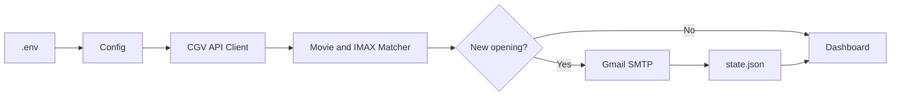

# CGV IMAX API Watcher

[](https://github.com/OWNER/cgv-imax-api-watcher/actions/workflows/ci.yml)


CGV 상영 일정 JSON API를 주기적으로 조회하여, 지정한 영화의 **IMAX 예매 일정이 처음 등록되는 순간 이메일로 알려주는 도구**입니다.

자동 예매, 로그인, 좌석 선택, 결제는 수행하지 않습니다.

## Quick Start

### Windows

1. `scripts\windows\setup.bat`
2. 생성된 `.env` 수정
3. `scripts\windows\test_email.bat`
4. `scripts\windows\check_once.bat`
5. `scripts\windows\run.bat`

### macOS

```bash
chmod +x scripts/macos/*.sh
./scripts/macos/setup.sh

# 생성된 .env 수정

./scripts/macos/test_email.sh
./scripts/macos/check_once.sh
./scripts/macos/run.sh
```


## One-Click Verification

설치와 `.env` 설정 후 전체 환경을 한 번에 검사할 수 있습니다.

### Windows

```text
scripts\windows\verify.bat
```

실제 테스트 이메일까지 포함:

```text
scripts\windows\verify_with_email.bat
```

### macOS

```bash
./scripts/macos/verify.sh
```

실제 테스트 이메일까지 포함:

```bash
./scripts/macos/verify_with_email.sh
```

검증 항목:

- Python 버전
- 필수 패키지
- `.env` 존재 여부
- 극장 및 날짜 설정
- IMAX 판별 로직
- 상태 파일 저장/조회
- 이메일 설정
- 실제 CGV API 연결
- 선택적 테스트 이메일 발송

정상 예시:

```text
Overall Result: 10 / 10 PASS
```


## Features

- CGV JSON API 직접 조회
- 여러 극장 동시 감시
- 날짜 범위 감시
- 영화명 키워드 검색
- IMAX 일정만 감지
- Gmail 이메일 알림
- 극장·날짜 조합별 중복 알림 방지
- Windows 및 macOS 지원
- 자동 재시도
- 단위 테스트와 GitHub Actions CI

## Configuration

`.env.example`을 `.env`로 복사한 뒤 수정합니다.

```env
SMTP_USER=your_account@gmail.com
SMTP_APP_PASSWORD=abcdefghijklmnop
MAIL_TO=your_account@gmail.com
SMTP_HOST=smtp.gmail.com
SMTP_PORT=465

THEATERS=용산아이파크몰:0013,영등포타임스퀘어:0059

DATE_FROM=2026-08-07
DATE_TO=2026-08-09
MOVIE_KEYWORD=스파이더맨

INTERVAL_SECONDS=120
REQUEST_TIMEOUT_SECONDS=20
USE_COLOR=true
```

여러 극장은 쉼표로 추가합니다.

```env
THEATERS=용산아이파크몰:0013,영등포타임스퀘어:0059,왕십리:0074,천호:0199
```

극장 코드는 CGV 극장 목록 API의 `siteNo`에서 확인할 수 있습니다.

```text
https://cgv.co.kr/api/v1/content/site/searchAllRegionAndSite?coCd=A420
```

## How Detection Works

다음 CGV 상영 일정 API를 조회합니다.

```text
GET https://cgv.co.kr/api/v1/booking/searchMovScnInfo
```

아래 조건을 동시에 만족하면 오픈으로 판단합니다.

```text
movNm / expoProdNm / prodNm에 MOVIE_KEYWORD 포함
AND
tcscnsGradCd == "03"
```

`tcscnsGradNm` 또는 상영관 이름의 `IMAX`, `아이맥스`도 보조 검증합니다.

## Architecture



## Development

```bash
pip install -r requirements.txt -r requirements-dev.txt
ruff check .
pytest
```

## Security

다음 항목은 GitHub와 배포 ZIP에 포함하지 마세요.

```text
.env
.venv/
state.json
```

앱 비밀번호가 노출되면 즉시 Google 계정에서 폐기하고 재발급하세요.

## Limitations

- PC가 켜져 있고 인터넷에 연결되어 있어야 합니다.
- 절전 모드에서는 감시가 중단될 수 있습니다.
- CGV API 구조 변경 시 업데이트가 필요할 수 있습니다.
- 외부 개발자용 안정성을 보장하는 공식 공개 API로 확인된 것은 아닙니다.
- 예매 성공을 보장하지 않습니다.

## License

MIT License
