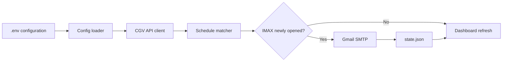

# Architecture

```mermaid
flowchart LR
    A[.env configuration] --> B[Config loader]
    B --> C[CGV API client]
    C --> D[Schedule matcher]
    D --> E{IMAX newly opened?}
    E -- No --> F[Dashboard refresh]
    E -- Yes --> G[Gmail SMTP]
    G --> H[state.json]
    H --> F
```

The watcher does not automate login, seat selection, or payment.
