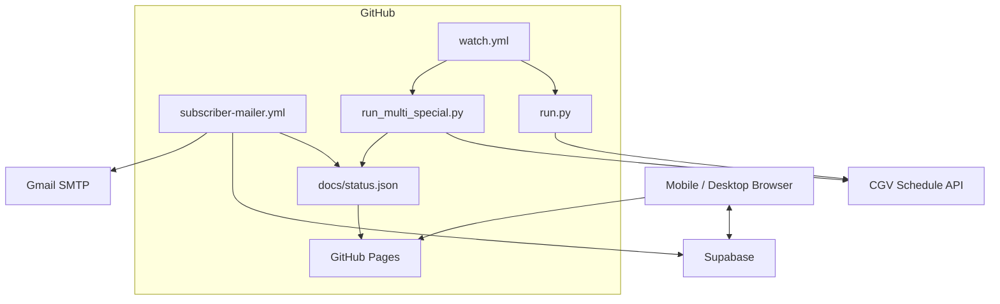
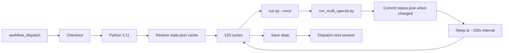
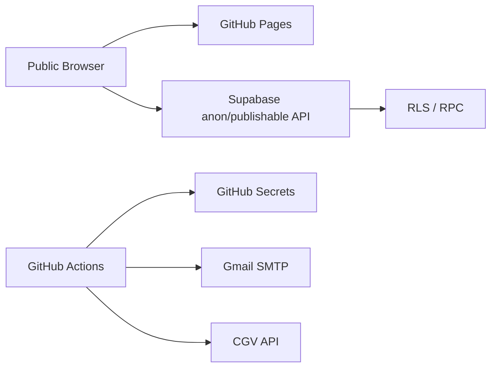

# CGV WATCHER Architecture

현재 안정화 버전의 실제 운영 구조를 기준으로 정리한 문서입니다.

## High-level Overview



## 1. Watcher Layer

### `run.py`

기존 개인 알림용 watcher entry point입니다.

```text
run.py
  -> src/cgv_imax_watcher/main.py
  -> Config
  -> CGV API
  -> Matcher
  -> Duplicate state
  -> Gmail notification
```

GitHub Actions에서는 `python run.py --once` 형태로 반복 호출합니다.

### `run_multi_special.py`

대시보드용 다중 target exporter입니다.

현재 기본 Target:

```text
odyssey_imax
  movie: The Odyssey / 오디세이
  format: IMAX

spiderman_screenx
  movie: Spider-Man: Brand New Day
  format: SCREENX
```

주요 역할:

1. 감시 대상 극장 파싱
2. Target 전체 날짜 union 생성
3. 극장/날짜별 CGV API 조회
4. 동일 조회 결과를 Target별 matcher에 재사용
5. 영화/특별관 상태 계산
6. `docs/status.json` 생성

CGV API:

```text
GET https://cgv.co.kr/api/v1/booking/searchMovScnInfo
```

영화 식별은 `movNo` exact match를 우선하고 영화명 키워드를 fallback으로 사용합니다.

특별관 판별 예:

```text
IMAX
- tcscnsGradCd == "03"
- 또는 관련 필드에 IMAX / 아이맥스

SCREENX
- 관련 필드에 SCREENX / 스크린엑스
```

## 2. Status Data

`docs/status.json`은 GitHub Pages 대시보드의 상태 소스입니다.

상위 구조 예:

```json
{
  "service": "CGV WATCHER",
  "status": "RUNNING",
  "checked_at": "...",
  "default_target": "odyssey_imax",
  "targets": {
    "odyssey_imax": {},
    "spiderman_screenx": {}
  }
}
```

개별 날짜 상태:

- `OPEN`
- `WAIT`
- `NO_SCHEDULE`
- `ERROR`

Target 집계 상태:

- `OPEN`
- `RUNNING`
- `DEGRADED`

기존 대시보드 코드와의 호환성을 위해 `format_open`/`format_count` 외에도 `imax_open`/`imax_count` alias가 유지됩니다.

## 3. GitHub Actions Runtime

### Watcher Session

`.github/workflows/watch.yml`



- 약 150초 간격
- 120 cycle
- 약 5시간 단위 세션
- 종료 후 다음 `watch.yml` 세션 자동 dispatch

### Subscriber Mailer

`.github/workflows/subscriber-mailer.yml`

- 약 30초 간격
- 약 5시간 단위 세션
- `status.json`과 Supabase 구독 정보를 사용
- Gmail SMTP 발송
- 종료 후 다음 mailer 세션 자동 dispatch

## 4. GitHub Pages Frontend

`docs/`는 실제 GitHub Pages root입니다.

### Bootstrap

```text
index.html
  -> app.html?t=<timestamp>
```

루트 문서를 아주 작은 bootstrap으로 유지하고 실제 UI를 `app.html`로 분리했습니다. 모바일 브라우저에서 루트 HTML이 오래 캐시되는 문제를 줄이기 위한 구조입니다.

### Actual App

`app.html`은 다음 모듈들을 사용합니다.

```text
app.html
├─ status.json
├─ chat.css / chat.js
├─ alerts.css / alerts.js
├─ layout-order.js
├─ reaction-leaderboard.js
├─ header-instagram.js
├─ app-cache-guard.js
└─ other UI helper modules
```

### Cache Stability

캐시 관련 파일:

- `docs/index.html`
- `docs/app-cache-guard.js`
- `docs/app-version.json`
- `docs/sw.js`
- `.github/workflows/ui-cache-version.yml`

현재 원칙:

1. 루트는 timestamp가 붙은 `app.html`로 이동
2. Service Worker는 동일 scope의 HTML/JS/CSS/JSON을 최신 네트워크 기준으로 처리
3. UI version marker를 자동 갱신
4. 초기 화면 흔들림 방지를 위해 Service Worker 등록 후 강제 reload는 하지 않음

## 5. Supabase Layer

Supabase는 브라우저 기능에 사용됩니다.

### Realtime Chat

주요 기능:

- 최근 50개 메시지
- Realtime insert/delete 반영
- Presence 접속자 표시
- 2초 전송 cooldown
- 관리자 모드

### Admin

관리자 관련 동작은 client UI만으로 보호하지 않습니다.

서버 측 RPC/RLS를 이용해 다음을 제한합니다.

- 관리자 비밀번호 검증
- 관리자 메시지 전송
- 관리자 메시지/채팅 삭제
- 일반 사용자의 보호 닉네임 사용

공식 관리자 표시명은 exact `관리자`입니다.

UI 표시:

- 관리자 닉네임: red
- 관리자 메시지: bold
- 별도 강한 카드 배경 없음

### Content / Nickname Guards

프런트엔드와 DB 양쪽에서 보호합니다.

보호 닉네임 substring 예:

```text
관리자
운영자
개발자
임우상
우상
```

금칙어는 punctuation/space 우회를 줄이기 위해 normalize 후 검사합니다.

## 6. Notification Layer

알림은 두 계층이 공존합니다.

### Legacy Personal Notification

`run.py` + `state.json`을 사용하여 기존 개인 Gmail 알림과 중복 방지를 유지합니다.

### Subscriber Notification

대시보드에서 관리되는 구독 정보는 Supabase에 저장되고 `subscriber-mailer.yml`이 별도로 처리합니다.

## 7. Data / Trust Boundaries



Public:

- GitHub Pages HTML/JS/CSS/JSON
- Supabase publishable/anon key
- `status.json`

Secret:

- Gmail App Password
- service-role key
- 관리자 credential 원본
- 기타 private token

## 8. Operational Characteristics

- `status.json` 자동 커밋으로 `main` HEAD가 자주 이동합니다.
- UI 수정 시 commit SHA보다 해당 파일의 blob SHA를 기준으로 수정 충돌을 확인하는 것이 안전합니다.
- repository에 commit이 존재해도 GitHub Pages build가 완료되기 전에는 실제 사이트에 반영되지 않을 수 있습니다.
- 모바일 UI 확인 시 루트 URL에서 `app.html?t=...`로 전환되는 것이 정상입니다.

## Project Boundary

이 시스템은 감시/알림용입니다.

자동 로그인, 좌석 예약, 자동 결제, CAPTCHA/접근제어 우회 기능은 포함하지 않습니다.
